**Estimated Reading Time: 15 minutes**

# UI Features In Depth
While it's entirely possible to narrow your search on OneStop down with just a few steps, as demonstrated in the previous [quick start guide](quickstart.md), many features enable very precise queries to be submitted.

The goal for this guide is to explain all the functionality available on the UI. Features are described in the order they are encountered -- from the landing page, through collection results, to file (granule) downloading.

## Features
  - [Query Text Box](#query-text-box)
  - [Popular Topics and Featured Data Sets](#popular-topics-and-featured-data-sets)
  - [Collection Results](#collection-results)
  - [Grid View and List View](#grid-view-and-list-view)
  - [Location Filters](#location-filters)
    - [Bounding Box Coordinates](#bounding-box-coordinates)
    - [Interactive Map](#interactive-map)
    - [Exclude Global Results](#exclude-global-results)
  - [Date Filters](#date-filters)
    - [Datetime](#datetime)
    - [Geologic](#geologic)
  - [Attributes Filters](#attributes-filters)
    - [Selecting Filters From Only One Category](#selecting-filters-from-only-one-category)
    - [Selecting Filters From Multiple Categories](#selecting-filters-from-multiple-categories)
  - [Collection Detail View](#collection-detail-view)
  - [File-Level Results](#file-level-results)
  - [Filename Filter](#filename-filter)
  - [Cart](#cart)

### Query Text Box
The query text box is the main starting point for searching on the OneStop UI. The query box is featured front-and-center on the landing page of OneStop, and is how a search is initiated.

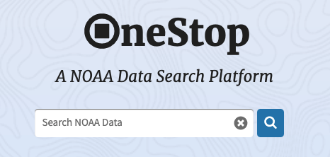

Once you've begun searching, however, the query box migrates to the site header. 

Entering text in the query box will always start a new search on OneStop, resetting any filters you may have added in an existing search. The text entered for your query can be a simple term or phrase, but can also support a much richer syntax allowing for a very precise request. 

Check out our guide on [Query Syntax](../../public-user/api/query-syntax) for thorough coverage of available options.

### Popular Topics and Featured Data Sets
Both of these features found on the landing page pre-populate a query for the user. The Popular Topics are simple high level categories from which to explore and discover data. On the other hand, Featured Data Sets queries are tailored to match a specific collection or set of collections. The Featured Data Sets are customizable by the site administrator and are therefore subject to change.

### Collection Results
All queries on the UI currently initialize to a search against collections. Collections are a high level grouping of similar data files -- they can represent all the data gathered by a single instrument on a satellite to a poster about a hurricane, and everything in between.

### Grid View and List View
The collection results can be displayed in grid or list view. The default, grid view, displays a representative image for the collection (or map of spatial bounds if none is available) with the title overlaid. Putting the tile in focus (via mouse hover, tabbing to it, etc.) expands the visible title length to three lines of text as opposed to one. 

Default out-of-focus grid collection tile appearance:

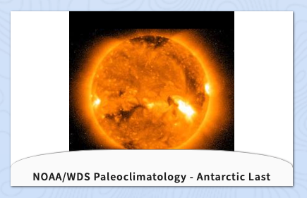

Grid collection tile appearance when in focus:

In order to view the collection results in list view format, click the list button on the right-hand side of the result count header above the results.

All results in list view default to a collapsed "card" showing just the full collection title and an option to "Show Details". The expanded list card shows the collection's spatial and temporal bounds in addition to the same representative image as the grid tile.

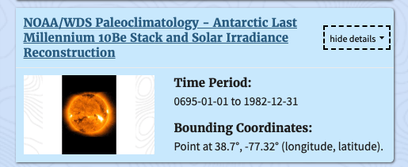

The buttons on the right-hand side of the result count header above the results enable you to return to grid view, expand all list cards, and collapse all list cards, respectively.

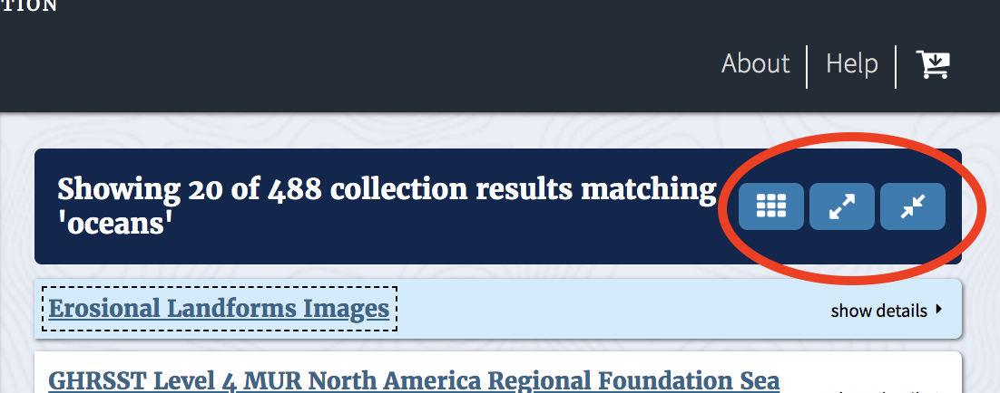

### Location Filters
The first filter in the Filters sidebar (or second if you're looking at individual file results) is the `Location` filter. From here, you can apply Earth-specific bounding box coordinates and a relation the query should have to the results. These coordinates can be specified exactly via the form or roughly by drawing a box across the interactive map. The two representations of the coordinates remain in sync regardless of the method chosen to apply a location filter. We have done our best to ensure the coordinates are applied in counter-clockwise order, which generally eliminates any issues when crossing the Prime Meridian, International Date Line, or both with the specified coordinates.

Here's an example showing an applied filter:

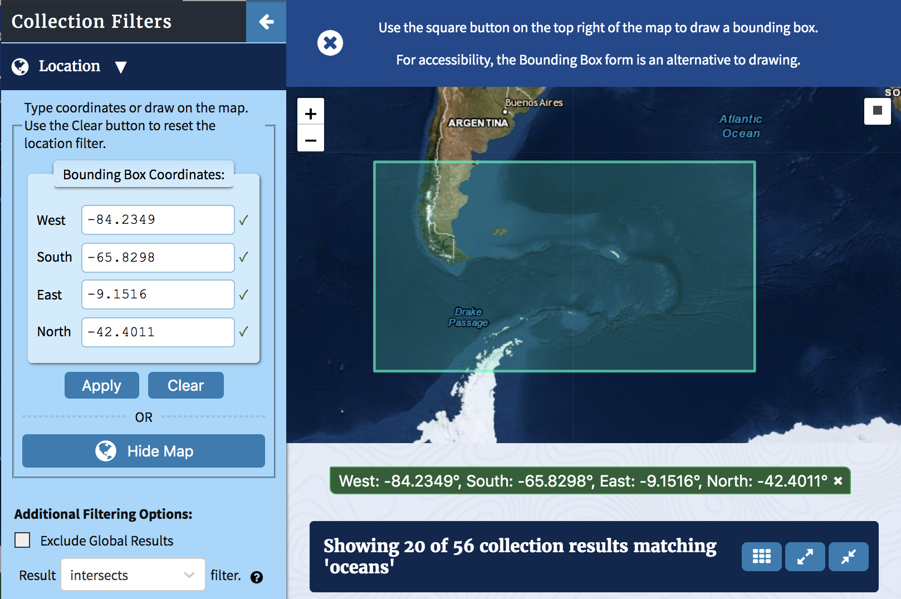

It is also possible to change the relation the result geometries have to the query to be one of the following:
* `intersects` -- Results must intersect the query value. This is the default selection.
* `within` -- Results are fully within query value.
* `disjoint` -- Results have nothing in common with query (opposite of `intersects`).
* `contains` -- Results fully contain the query value.

This relation can be changed using the drop-down list located at the bottom of the `Location` filter panel. Clicking the question mark next to the drop down reveals an interactive diagram that both visualizes and explains (hover over for text) how this relationship affects returned results. The `Exclude Global Results` option is also helpfully included in the explanations.

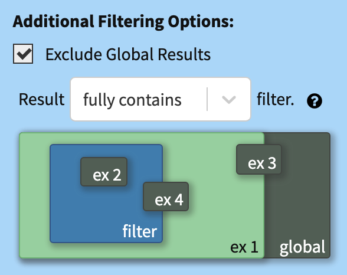

#### Bounding Box Coordinates
The bounding box coordinates can be manually entered into a set of text fields, and must abide by a few guidelines:
* Longitudes (East and West) must be between -180 and 180 degrees, whereas latitudes (North and South) must be between -90 and 90 degrees. 
* The North coordinate value must always be greater than the South coordinate value. 
* The coordinates must create a rectangle, i.e., West cannot be equal to East and North cannot be equal to South (which would actually represent a line or point).

If any of the above are attempted, an error is shown:

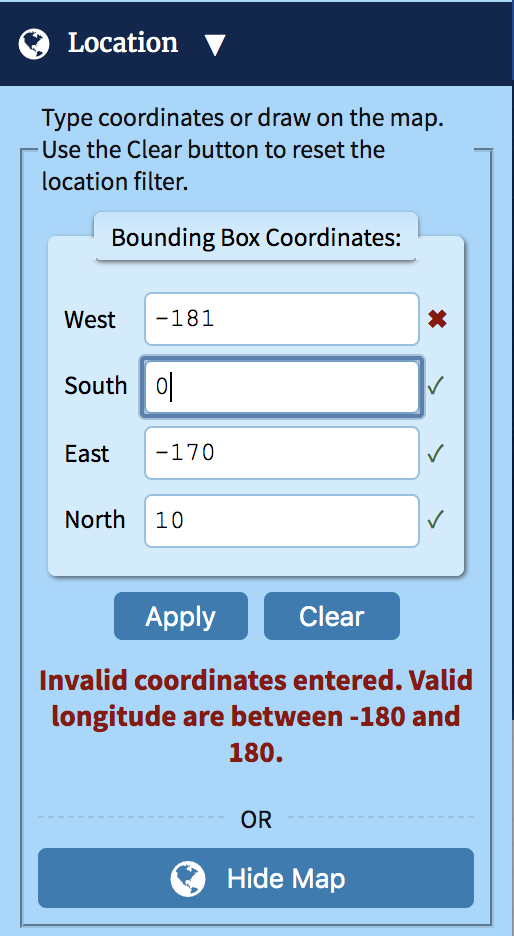

The form coordinates will not create a filter on the search results until the `Apply` button is selected. Use of the `Clear` button will both erase the contents of the text boxes and remove any applied location filter.

#### Interactive Map
The map can be displayed using the `Show Map` button. Clicking the square button on the top right corner of the map enables a drawing mode, which is exited once a bounding box is drawn. The map can be panned in any direction, allowing any start and end points. Zooming in and out is accomplished via scrolling over the map or using the `+` and `-` buttons on the top left side of the map. To collapse the map from view, use the `Hide Map` button.

Please be aware that while it is technically possible to draw a rectangle that overlaps itself longitudinally, such a filter will fail to be applied resulting in an unspecified error message. Once a bounding box is drawn, the filter is automatically applied to the search and results will update. The map will also center itself around your filter.

#### Exclude Global Results
Many collections have data covering the entire globe. Depending on the data you're looking for, these datasets may be undesired especially when applying a spatial query with the `intersects` or `contains` relations. The global-coverage results can be omitted by selecting the `Exclude Global Results` checkbox above the relation drop-down list.

### Date Filters
The second option in the Filters sidebar (or third if you're looking at individual file results) is the `Date` filter. Any date in the history of the Earth can be applied to filter the search results from here using either a `Datetime` filter or a `Geologic` filter. Similar to the `Location` filter, one of four relations can be selected:
* `intersects` -- Results must intersect the query value. This is the default selection.
* `within` -- Results are fully within query value.
* `disjoint` -- Results have nothing in common with query (opposite of `intersects`).
* `contains` -- Results fully contain the query value.

Both date filters allow for fully bounded or unbounded date ranges. In other words, you may specify a start and end date, just a start date, or just an end date. Omitting the start date implies a range of "beginning of time" to the given end date (i.e., any time until the end date), whereas omitting the end date implies a range of the given start date to the "present" (i.e., any time since the start date). A real life example of the latter would be a still-active satellite instrument generating data since entering orbit.

An illustrative help diagram is available beneath the relation drop-down list, as shown in the image below. Like the interactive display in the `Location` filter, this updates with applied filters. Interactions between bounded and unbounded filters/results are rendered both visually and textually (hover over for text).

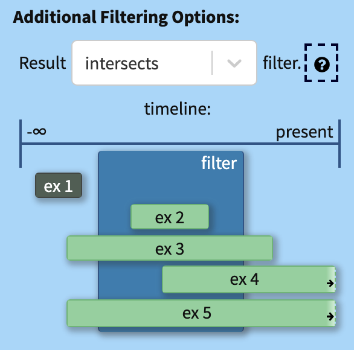

Only one date filter can be applied at any given time. What this means is that you can apply either a datetime filter _or_ a geologic date filter. Attempting to apply both will replace the first applied filter with the second. The UI will warn of this if you add a Date filter and switch to the tab of the other Date type:

#### Datetime
The default date option is the `Datetime` filter. Dates here can be anytime between January 1, 0000 to the present date. It is possible to submit a datetime filter by entering only a year or a year and month. The filter will auto-populate the missing field(s) -- to January if no month is specified, and to day 1 if no day is specified. 

To the right of each date entry form there will either be a green check mark or red cross to immediately indicate if a date is valid or invalid, respectively. Selecting the `Apply` button with one or both dates being erroneous will generate an error message specifying what dates are in error and a filter will not be applied to the search. Typical reasons for a date being considered incorrect are: non-existent dates, proving a day without also including a month and year, future dates, and non-numerical text (which includes a negative sign).

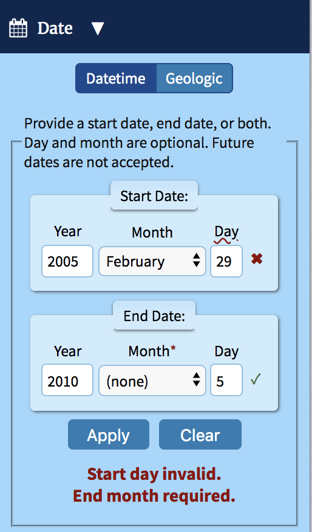

#### Geologic
The `Geologic` Date filter allows the user to search by year without a lower limit, which is typically useful for paleontological time frames. 

Two year formats are permitted here: Common (or Current) Era, C.E., and Before Present, B.P. The C.E. format correlates to the year as described in the `Datetime` filter, so 2010 there is exactly the same as 2010 here. On the other hand, B.P. refers to the number of years _before_ the present, which is conventionally defined as 1950 C.E. This means, for example, 2010 C.E. is equivalent to -60 B.P. and -50 C.E./50 B.C.E. corresponds to 2000 B.P. Values entered in the text boxes are automatically adjusted to the correct value if the other Year Format radio button is selected.

In addition to the two year formats, these fields also allow shorthand SI units (not case sensitive) to be entered in the text boxes. The units -- ka (kiloannum), Ma (megaannum), and Ga (gigaannum) -- represent one thousand, one million, and one billion years, respectively. Thus, you can enter `-4600000000`, `-4600000 ka`, `-4600 Ma`, or `-4.6 Ga` for 4.6 billion years B.C.E.

To the right of each year entry form there will either be a green check mark or red cross to immediately indicate if a date is valid or invalid, respectively. Selecting the `Apply` button with one or both dates being erroneous will generate an error message specifying what dates are in error and a filter will not be applied to the search. Errors likely to be encountered here are non-numerical text that is not one of the allowed SI units and future years.

Regardless of how you choose to declare your `Geologic` dates, the corresponding filter tags will appear as comma-separated C.E. years.

Finally, the `Geologic` dates also have a short list of pre-identified time intervals that can be selected. The text boxes will automatically be populated with the corresponding year values if you choose any options from this list, and the filters will be automatically applied to your search.

### Attributes Filters
The third option in the Filters sidebar (or fourth if you're looking at individual file results) is the `Attributes` filter. The Attributes are subsections corresponding to Data Formats, Link Protocols, and a subset of categories from [NASA's Global Change Master Directory (GCMD) Keywords](https://earthdata.nasa.gov/earth-observation-data/find-data/gcmd/gcmd-keywords). Our subset of categories is:
* Earth Science (which we call "Data Theme" and omit the leading "Earth Science" from in the actual keyword)
* Data Centers
* Projects
* Instruments
* Platforms
* Horizontal Data Resolution
* Vertical Data Resolution
* Temporal Data Resolution

Given that the GCMD Keywords are continually evolving, this list is subject to change.

Most of the Attributes are presented in a non-hierarchical form except for `Link Protocols` and `Data Theme`. Where GCMD Keyword categories are concerned, this is done because that category's hierarchy is non-existent (the Resolution categories) or in the form "Short Name > Long Name" and we are displaying only the "Long Name" value. For the hierarchically rendered keywords, the filter can be applied at any level. 

Categories can be expanded or collapsed by clicking on the category header bar. The numbers beside each keyword indicate the subset of results matching the attribute term. Applying an Attribute term filter to your search is straightforward -- simply select the checkbox to the left of the term -- but how it ends up applied to your search varies if multiple terms are chosen from the same or multiple categories.

#### Selecting Filters From Only One Category
In the image below, the Data Theme category is expanded to show several layers of keywords. In this instance there are 83 matches for "Oceans > Ocean Temperature" but 5 matches for "Oceans > Ocean Temperature > Sea Surface Temperature > Blended Sea Surface Temperature", the latter being a subset of the former.

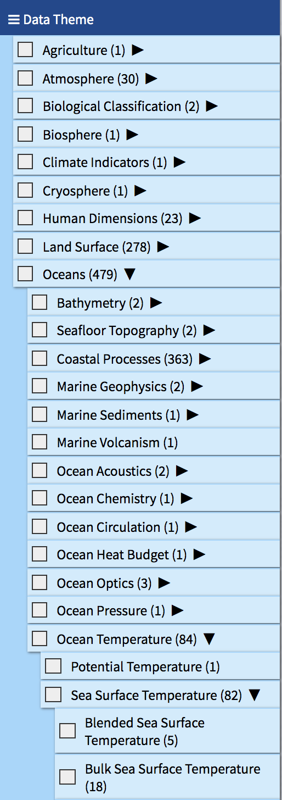

If we check the box to apply the "Oceans > Ocean Temperature" keyword filter, you'll notice some other keywords appear greyed-out and can no longer be selected. Likewise, counts have updated on many keywords to continue to show the subset of updated results matching the attribute term. What this means is that these keywords no longer apply to your results. 

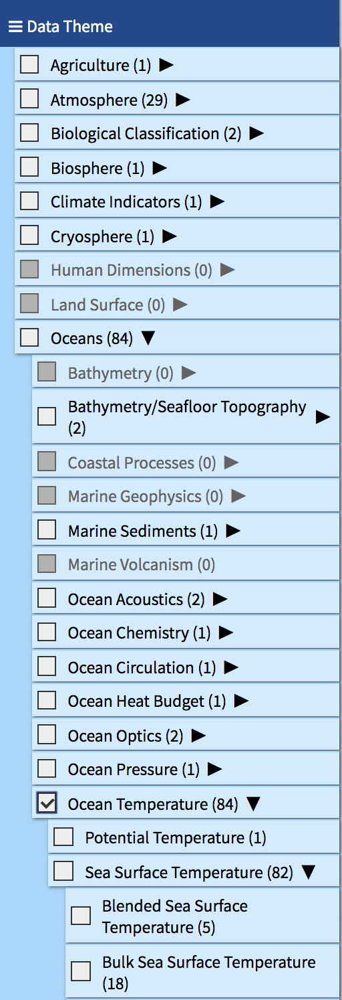

It is possible to select additional keywords to apply as filters from the same category. However, multiple same-category filters are applied with OR logic, meaning results can contain _either or both_ keywords (plus your text query) in order to match. If you select multiple filters from the same category, you will see either no change in the result count or an increase in the result count. 

Just "Oceans > Ocean Temperature" applied:

No change when "Oceans > Ocean Temperature" and "Atmosphere > Aerosols" applied:

An increase when "Oceans > Ocean Temperature" and "Spectral/Engineering" applied:

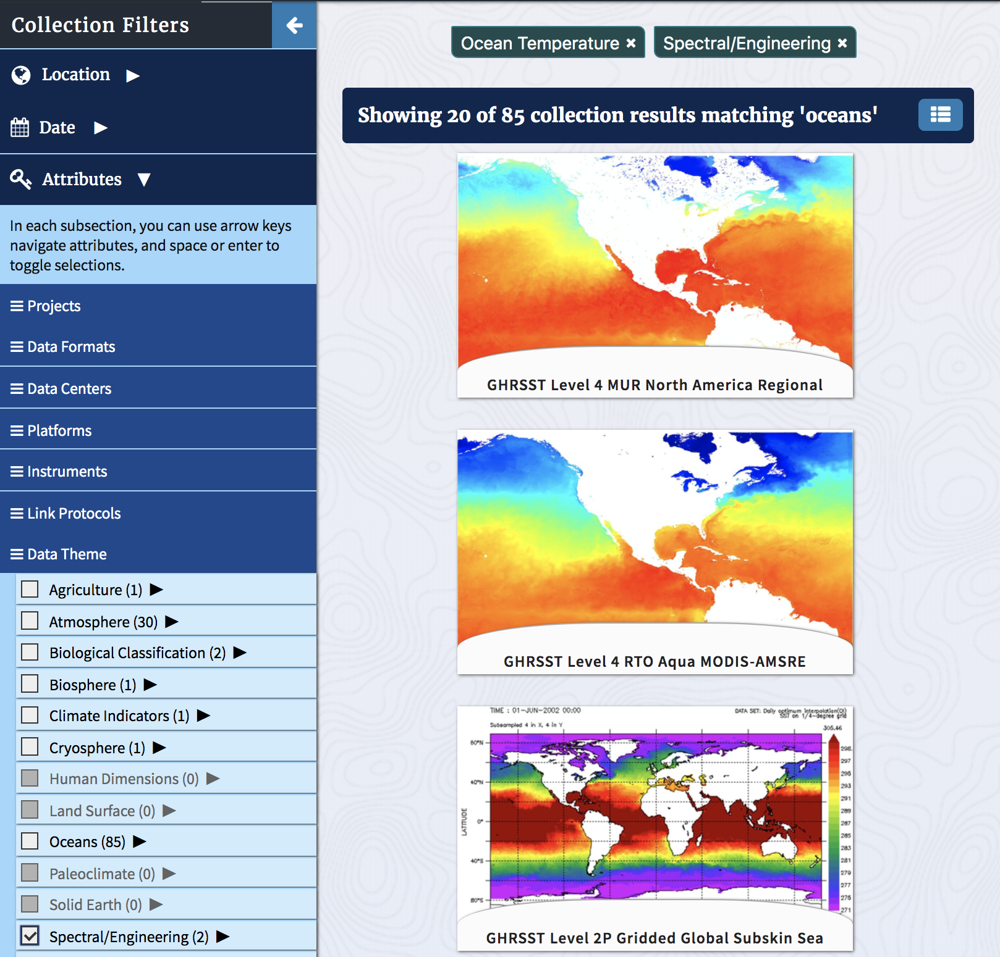

In the last case, you'll notice the number of records matching the "Spectral/Engineering" keyword jumped from 1 to 5. The adjusted counts simply reflect that the results match the query text AND one of "Oceans > Ocean Temperature" OR "Spectral/Engineering". You can sanity check this by removing both keyword filters. The updated Data Theme list shows a count of 5 matches for "Spectral/Engineering".

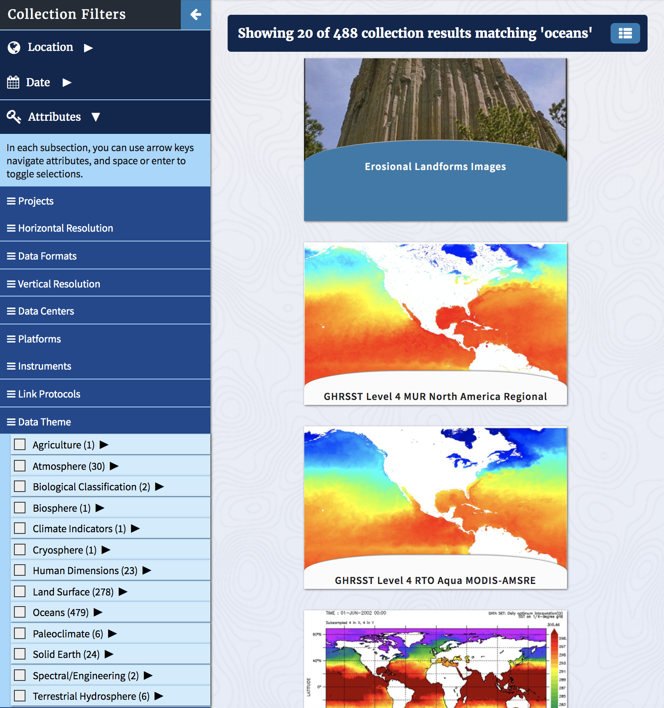

#### Selecting Filters From Multiple Categories
Filters from different categories are applied to the search with AND logic as opposed to OR logic when from the same category. This means that, for instance, if you were to filter by the Data Theme "Spectral/Engineering" and the Link Protocol "FTP", your results are a cross-section of records matching your text query AND "Spectral/Engineering" AND "FTP". As a consequence of this, selecting filters from more than one category will either produce no change in the result count or a decrease in the result count.

### Filter Tags
Every filter applied to the search from the Filters sidebar creates a tag at the top of the search results. Filters can be quickly removed from the search by clicking on the tags. 

### Collection Detail View
Selecting a collection result will take you to that collection's detailed view page. From the top down, you'll encounter the full title, a representative image for the collection, and the full description. To the right of the description is a link taking you to the searchable granules, if any, available on OneStop for this collection. These results maintain any filters you may have applied, so you may come across text like "Show 0 matching files of 28 in collection" here. Beneath the `Files` section are expandable sections for `Citation` (use this for citing the data in your own research) and `Identifier(s)` (collection file identifier and DOI, if exists). 

The bottom half of the collection detail page is a tabbed view, which defaults to the `Overview`. This broad summary has the collection's temporal coverage, spatial coverage, theme (Earth Science), instrument, and platform GCMD keywords (if present), and DSMM rating. The DSMM rating, or Data Stewardship Maturity Matrix, is an average score of 9 distinct components assessing how well cared for the dataset is and its quality and usability for various end-users. A thorough discussion of the DSMM is publicly available to read [here](https://doi.org/10.2481/dsj.14-049). This link can also be found by selecting `show info` next to the star rating at the bottom of any collection detail page.

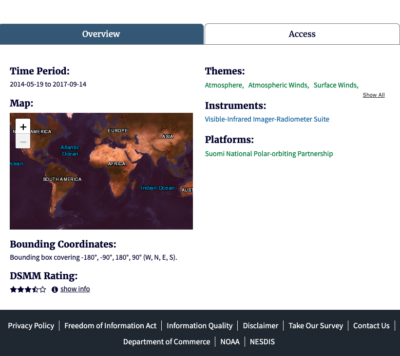

Switching over to the `Access` tab view, you can find a variety of high level access links for the collection at large, links to related `Services`, and the `Distribution Formats` of the collection's individual files. Regardless of what metadata is available in OneStop for a collection, the `Information`, `Download Data`, and `Distribution Formats` sections will always be present. If related links are available, there may also be one or more of the following sections: `Search for Data`, `Order`, `Offline Access`, `Services`.

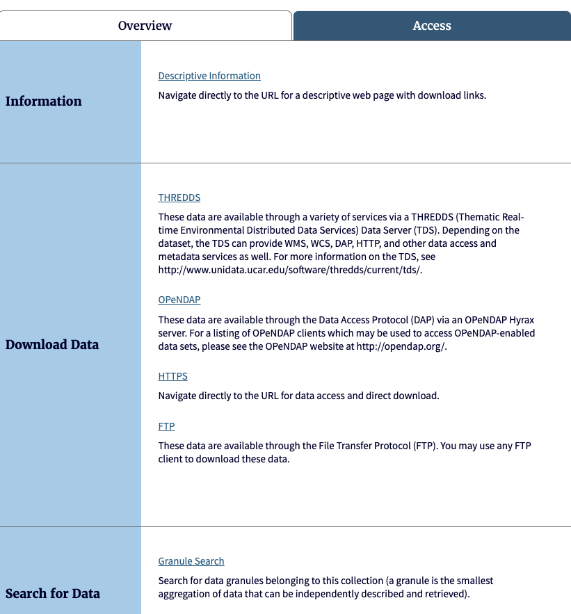

### File-Level Results
If a collection has files whose metadata has been loaded into OneStop, it is possible to search across them from the `Show __ matching files of __ in collection` link at the top of the collection detail page. The file results initialize with [the](#location-filters) [same](#date-filters) [filters](#attributes-filters), if any, used in your collection search. These can be removed or modified as desired.

File Results are only viewable in [list view](#grid-view-and-list-view) (no grid view). Every card in the list initializes as collapsed, but all cards can be expanded at once using the "Expand All" button in the results count header (likewise, the "Collapse All" button does the inverse operation). Unlike the result count header buttons in the collection results, however, file results have a shopping cart button at the top of the list. Selecting this button is a quick way to add every matching file in the results to your [cart](#cart) for downloading. Alternatively, files can be added on an individual level from each list card.

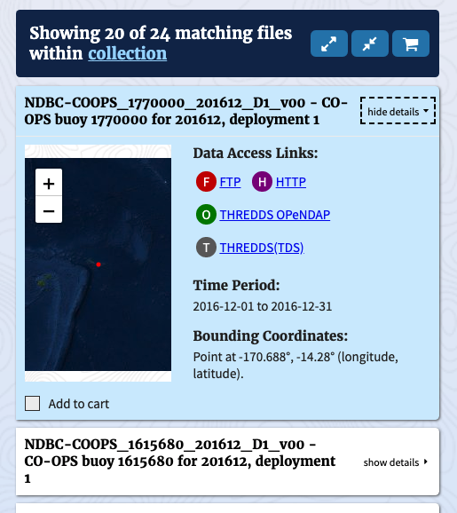

Selecting `show details` to the right of the title on a card will expand the card to reveal the file's representative image (or map of spatial bounds if none is available), access links, temporal bounding, and spatial extent in addition to the title. The bottom of the card has an `Add to cart` checkbox that will automatically add (or remove) the file from your cart when selected.

### Filename Filter
The first filter in the Filters sidebar for File Results _only_ is the `Filename` filter. This filter searches against only the filenames, and can help serve as the final narrowing down of results to locate exactly what you're looking for.

### Cart
Once you have found and added files to your cart, you'll want to download them for use. From the cart page, you can generate a list of links from your chosen files by file access type (e.g., FTP or THREDDS). This list can then be used in concert with a downloading utility, like `wget`, to download the actual data to your machine. If, however, you would like to empty your cart, this can be accomplished by selecting the "Clear All Files From Cart" button on the very left edge of the cart's count header above the list of files. 

A view of the cart page with info section expanded:

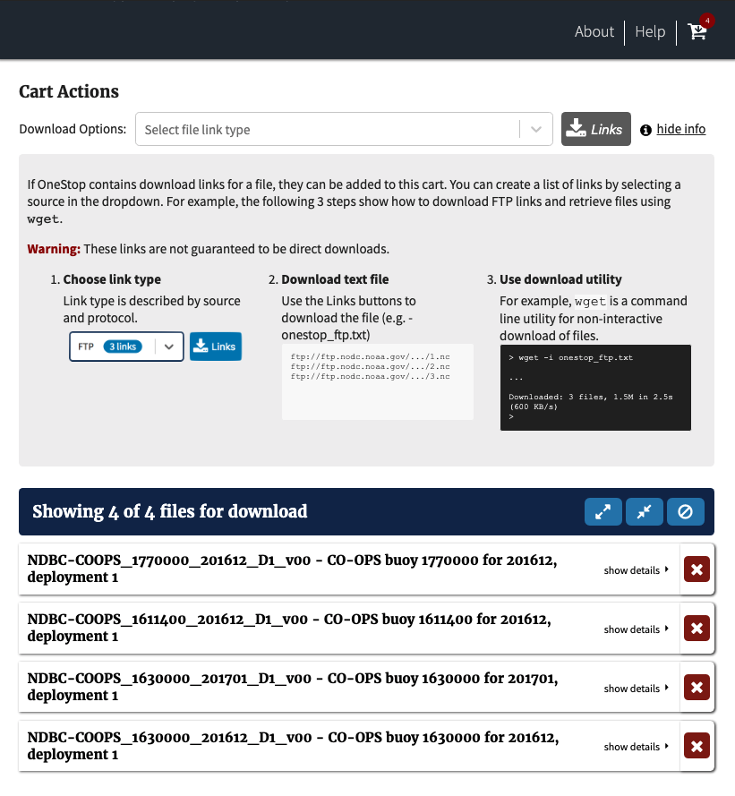

An example of file access types shown in the file link type drop-down list:

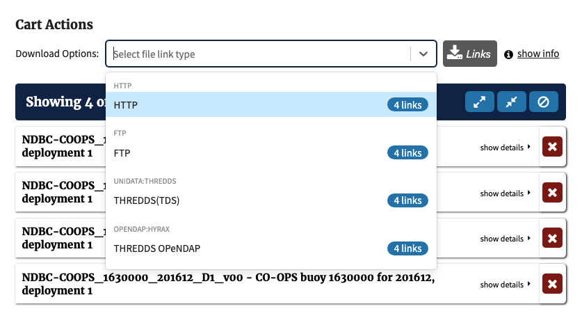

<a href="/onestop/public-user/ui/quickstart">Previous</a> | <a href="#ui-features-in-depth">Top of Page</a> | <a href="/onestop/public-user/ui/keyboard-navigation">Next</a>
